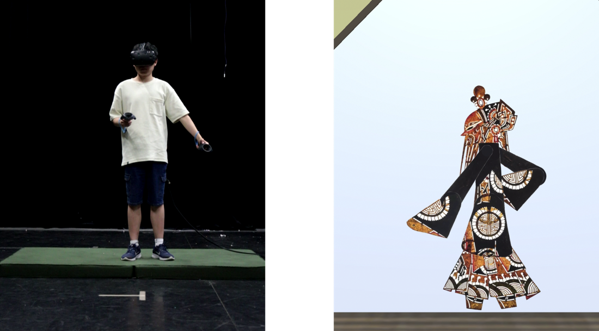

# ShadowPlayVR-Interaction

**ShadowPlayVR**   uses VR controllers to simulate the manipulation of shadow puppet rods, achieving similar effects to traditional shadow puppetry performance art. The ShadowPlayVR  system offers a unique perspective by positioning users in the role of a real-world puppeteer operating behind the scenes, controlling puppets to perform. 

To accurately capture the essence of shadow puppetry, ShadowPlayVR incorporates the structural elements of real puppetry stages, studies the craftsmanship of puppet making, and adopts the artistic styles typical of the art form. Crucially, it integrates traditional puppetry techniques with VR control features through specially designed embodied interactions that simulate the tactile experience of real puppetry. In the ShadowPlayVR experience, users control virtual puppets using limited input devices, adopting gestures and full-body movements akin to those used in traditional shadow puppetry, thereby offering an immersive performance experience within the virtual environment.

## About Shadow Play

Shadow play, with its reliance on puppet manipulation and visual storytelling, recognized in the UNESCO Intangible Cultural Heritage list,  presents an exemplary case of how VR can extend traditional artistic practices into the digital realm. The art form's emphasis on manipulation closely mirrors the general input method (controllers) to VR, making it an ideal subject for investigating the potential of VR to recreate real life hand-on traditional skills through interaction design and support artistic practice within, engage diverse audiences.

## Interaction Design

Adapting the art of shadow puppetry to virtual reality systems requires adjustments in interaction. ShadowPlayVR, based on the craft of shadow puppetry, features two main control characteristics: multi-point coordination and indirect manipulation. 
- Multi-point coordination requires puppeteers to control multiple joints of the puppet simultaneously with rods to achieve complete movements. 
- Indirect manipulation means the puppeteer's hand movements do not directly correspond to the puppet's movements; instead, movements are translated through the control rods to manipulate the puppet. 

The standard control method for traditional shadow puppets involves six joint parts: the head (neck) control joint, two arm (wrist) control joints, a waist control joint, and two leg (ankle) control joints.  In some simplified puppet models, the waist and leg controls are omitted, with upper body movements driving the lower body. To make puppet control more compatible with VR device architecture, the VR environment adopts a simplified puppet control approach with adjustments. It retains the core head and arm (wrist) control joints, combines the waist and head joint responsibilities into a new body control joint, and achieves relative leg movements through the movement of the upper body parts.

Based on the adjustments to the shadow puppet control methods, ShadowPlayVR has developed multiple control methods focused on key control joints. Through the following four key controls, a basic, gradient control method is established that allows for shadow puppet performance (listed by difficulty and intuitiveness):

1.	[**Head Control**](https://github.com/CidsHo/ShadowPlayVR-Interaction/blob/main/InteractionDesignMix/MoveWithElevation.cs) (Simple, intuitive, direct control): The puppet's head angle is determined by the user's viewing angle.
2.	[**Body Movement Control**](https://github.com/CidsHo/ShadowPlayVR-Interaction/blob/main/InteractionDesignMix/ObjectPositionBasedOnCameraMovement.cs) (Simple, intuitive, direct control): When facing the puppet, the puppet moves in the same left and right direction as the controller.
3.	[**Hand Control**](https://github.com/CidsHo/ShadowPlayVR-Interaction/blob/main/InteractionDesignMix/FollowControllerXY.cs) (Advanced, indirect control): The controller faces the screen, and the point where the controller faces on the screen is the corresponding control point for the puppet.

Demo-HandControl

<pre><code>

     
    
    
    
    
    
     

</code></pre>

4.	[**Body Flipping Control**](https://github.com/CidsHo/ShadowPlayVR-Interaction/blob/main/InteractionDesignMix/FlipOnControllerSwitch.cs) (Advanced, indirect control): The controller must cross hands, causing the distance between the two controllers in hand to exceed a certain value, after which the puppet performs a mirrored flip

Demo-Rigging

<pre><code>

     
    
     

</code></pre>

Side Control Settings(Adding favor to Design XD)
1. [Force Player Foward](https://github.com/CidsHo/ShadowPlayVR-Interaction/blob/main/InteractionDesignMix/ForcePlayerForward.cs) Standard pose for experiment setting.
2. [Tele-control (Item)](https://github.com/CidsHo/ShadowPlayVR-Interaction/blob/main/InteractionDesignMix/MoveObjectWithController.cs) Item control via controller (Adapted).

*See InteractionDesignMix folder for detailed design.*
